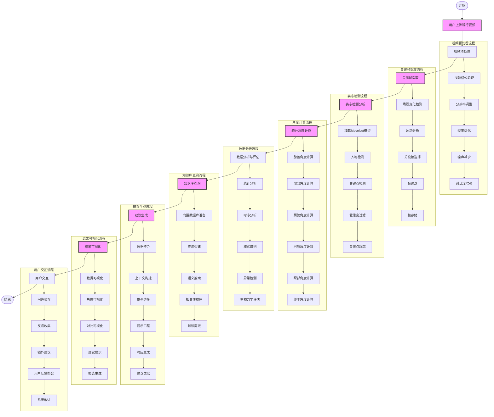

# Bike-fit with AI

本项目是是一位没钱做fitting的自行车爱好者，为了让大家都能体验fitting服务并且减少伤病风险而开发的。本项目通过上传骑行的视频，通过姿态检测计算出几个骑行的时候的关键部位的角度。将角度等需要fitting的参数输入给lightrag项目，lightrag进行检索之后将完整的prompt发给llm模型进行输出。

## 功能特点

- **视频自动分析**：上传骑行视频，系统自动检测骑行姿态并收集关键数据
- **MoveNet姿态检测**：采用先进的MoveNet模型实时检测和分析骑行者的身体姿态
- **智能建议生成**：基于专业知识库和检测数据，提供个性化的自行车适配建议
- **RAG知识增强**：利用LightRAG构建向量数据库，提供基于专业文献的精准建议
- **灵活模型支持**：同时支持本地Ollama模型和OpenAI兼容API接口

## 安装

### 环境要求

- Python 3.10+
- Conda 环境管理器

### 步骤1：克隆仓库

```bash
git clone https://github.com/yourusername/Bike-fit.git
cd Bike-fit
```

### 步骤2：创建Conda环境

```bash
# 对于Mac用户
conda env create -f env-mac.yml

# 对于支持CUDA的系统
conda env create -f environment-cuda.yml

# 激活环境
conda activate Bike-fit
```

### 步骤3：下载必要模型

```bash
python download_models.py
```

### 步骤4：配置环境变量

```bash
# 复制环境变量示例文件
cp .env.example .env

# 编辑.env文件，填入必要的API密钥和配置
```

## 快速开始

### 启动后端服务

```bash
cd backend/server
python __main__.py
```

### 访问Web界面

打开浏览器访问：`https://demo.kittybob.com/demo`

### 使用流程

1. 上传骑行视频
2. 系统自动分析骑行姿态
3. 查看分析结果和调整建议
4. 根据需要与AI助手进行交互，获取更详细的建议

## 项目工作流程

### 工作流程图



### 详细工作流程说明

1. **视频输入处理**：
   - 用户上传骑行视频（支持多种格式：MP4, AVI, MOV等）
   - 视频格式验证与质量检查
   - 视频预处理（分辨率调整、帧率优化、噪声减少）
   - 系统提取关键帧（基于场景变化和运动分析）
   - 关键帧存储与索引

2. **姿态检测分析**：
   - 加载预训练的MoveNet模型
   - 人物检测与分割
   - 识别17个关键骑行姿态点（头部、肩膀、肘部、手腕、髋部、膝盖、踝部等）
   - 关键点置信度过滤（去除低置信度检测）
   - 关键点时序跟踪与平滑处理
   - 计算关键角度：
     * 膝盖角度（KFA - Knee Flexion Angle）
     * 髋部角度（HFA - Hip Flexion Angle）
     * 肩膀角度（SFA - Shoulder Flexion Angle）
     * 肘部角度（EFA - Elbow Flexion Angle）
     * 踝部角度（AFA - Ankle Flexion Angle）
     * 躯干角度（TFA - Torso Flexion Angle）

3. **数据分析与评估**：
   - 统计分析（平均值、标准差、最大/最小值）
   - 时序分析（角度变化趋势）
   - 骑行模式识别
   - 异常姿势检测
   - 生物力学评估（基于专业标准）

4. **知识库查询**：
   - 向量数据库准备（基于自行车适配专业文献）
   - 基于检测结果构建语义查询
   - 执行语义搜索（使用余弦相似度）
   - 相关性排序与过滤
   - 从专业文献中提取相关知识点

5. **AI建议生成**：
   - 数据整合（检测数据 + 知识库内容）
   - 上下文构建（包含用户信息、检测结果、知识点）
   - 模型选择（本地Ollama模型或OpenAI API）
   - 提示工程（构建专业化提示）
   - 生成个性化的自行车适配建议：
     * 车座高度调整
     * 车座前后位置
     * 把立高度与角度
     * 把横长度与角度
     * 脚踏位置调整

6. **结果展示**：
   - 数据可视化（关键数据图表展示）
   - 角度可视化（关键角度标注与展示）
   - 对比可视化（与标准姿势对比）
   - 建议展示（分类展示各项调整建议）
   - 综合报告生成（PDF格式）

7. **用户交互**：
   - 问答交互（用户可提问获取更详细解释）
   - 反馈收集（用户对建议的评价）
   - 根据反馈提供额外建议
   - 用户反馈整合到系统
   - 系统持续学习与改进

## 使用的开源项目

- [MoveNet](https://github.com/tensorflow/tfjs-models/tree/master/pose-detection/src/movenet) - 用于人体姿态检测
- [MinerU](https://github.com/opendatalab/MinerU) - 用于将PDF文献转换为MD格式
- [LightRAG](https://github.com/namuan/light-rag) - 轻量级检索增强生成框架
- [Ollama](https://github.com/ollama/ollama) - 本地大语言模型部署工具

## 文档


## 贡献

欢迎贡献代码、报告问题或提出新功能建议！

1. Fork 本仓库
2. 创建您的特性分支 (`git checkout -b feature/amazing-feature`)
3. 提交您的更改 (`git commit -m 'Add some amazing feature'`)
4. 推送到分支 (`git push origin feature/amazing-feature`)
5. 开启一个 Pull Request

## 许可证

本项目采用 MIT 许可证 - 详情请参见 [LICENSE](LICENSE) 文件

## 联系方式

项目维护者 - [Henry Zhang](henryzhang070@gmail.com)