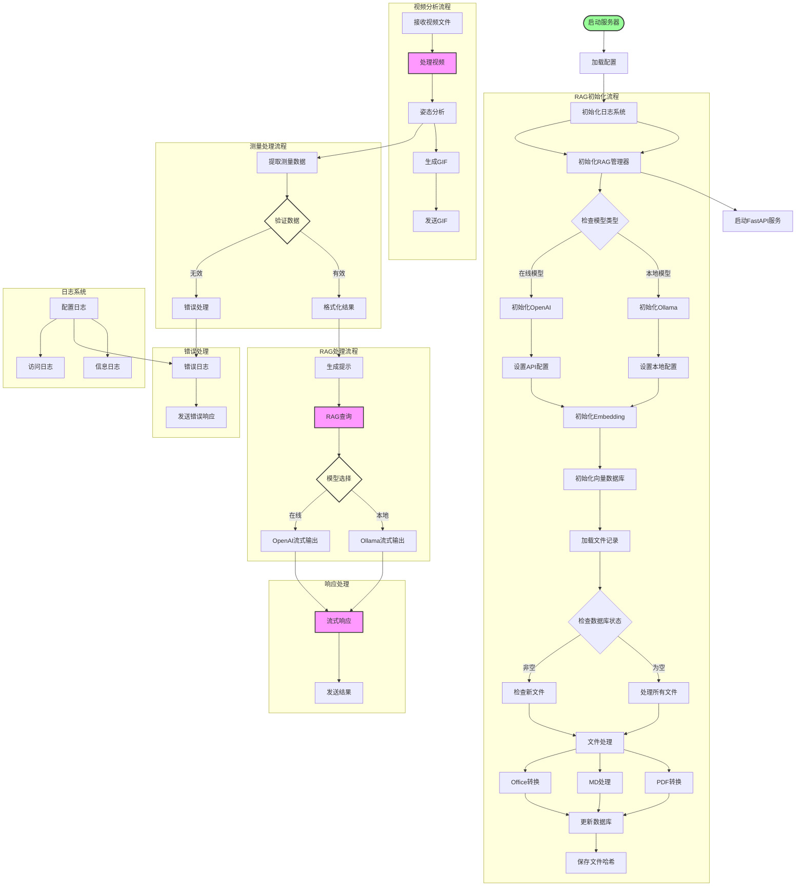

# LightRAG 文档处理与向量数据库构建

本模块提供了将各种文档文件（PDF、Markdown、Office文档）自动处理并构建向量数据库的功能。

## 功能特点

- 自动检测向量数据库是否为空
- 当数据库为空时，自动处理所有文件并构建向量数据库
- 支持多种文件格式：
  - PDF文件直接转换为Markdown
  - Markdown文件直接添加到数据库
  - Office文档（doc, docx, ppt, pptx）先转换为PDF，再转为Markdown
- 文件变更检测：只处理新增或修改的文件
- 支持OCR和文本模式的PDF处理
- 提供同步和异步查询接口
- 支持多种查询模式：local、global、hybrid、naive、mix

## 使用方法

1. 配置环境变量

在项目根目录的`.env`文件中设置以下变量：

```
# 源文件目录（存放PDF、MD、Office文档）
PDF_SOURCE_DIR=./pdfs

# MD临时文件目录
MD_TEMP_DIR=./md_temp

# 向量数据库存储路径
VectorData_path=./backend/Light_rag/lr_db
```

2. 准备文档文件

将需要处理的文件放入`PDF_SOURCE_DIR`指定的目录中，支持以下格式：
- PDF文件（.pdf）
- Markdown文件（.md）
- Word文档（.doc, .docx）
- PowerPoint演示文稿（.ppt, .pptx）

3. 安装依赖

对于Office文档转换，需要安装LibreOffice：

```bash
# Ubuntu/Debian
sudo apt-get install libreoffice

# macOS
brew install --cask libreoffice

# Windows
# 下载并安装LibreOffice: https://www.libreoffice.org/download/
```

4. 初始化LightRAG

```python
from backend.Light_rag.lightrag_ollama_demo import LightRagManager

# 初始化LightRAG管理器
manager = LightRagManager("./lr_db")

# 系统会自动检查向量数据库状态：
# - 如果为空，处理所有文件并构建数据库
# - 如果不为空，检查是否有新文件或修改的文件需要处理
```

5. 查询

```python
# 同步查询
result = manager.query("什么是bike fitting?", stream=True, only_need_context=False)
print(result)

# 异步查询
import asyncio
result = asyncio.run(manager.query_async("什么是bike fitting", stream=True))
print(result)
```

## 工作流程



1. **初始化阶段**
   - 初始化LightRAG管理器
   - 检查向量数据库状态
   - 加载已处理文件记录

2. **文件处理阶段**
   - 扫描源目录文件
   - 按类型分类处理：
     * Office文档：转PDF → Markdown → 数据库
     * PDF文件：转Markdown → 数据库
     * Markdown文件：直接添加到数据库

3. **记录更新阶段**
   - 更新处理记录
   - 保存文件哈希值
   - 完成数据库构建

4. **查询阶段**
   - 支持同步查询
   - 支持异步查询
   - 多种查询模式选择

## 注意事项

- 确保已安装所有必要的依赖项，特别是LibreOffice（用于Office文档转换）
- 文档处理可能需要较长时间，特别是对于大型文件或需要OCR的文件
- 系统会自动跳过已处理且未变更的文件，提高效率
- 处理记录保存在向量数据库目录下的`processed_files.json`文件中 