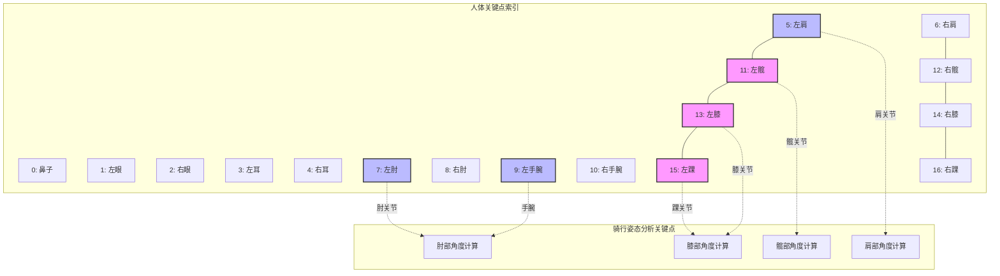
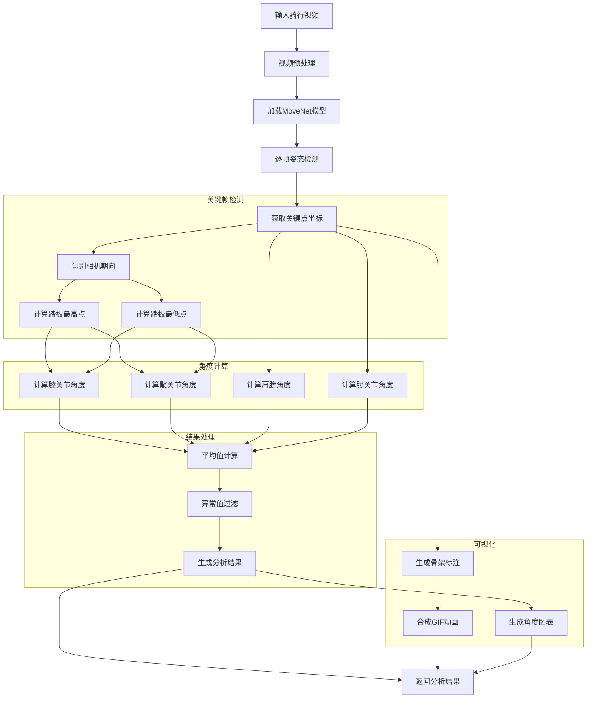
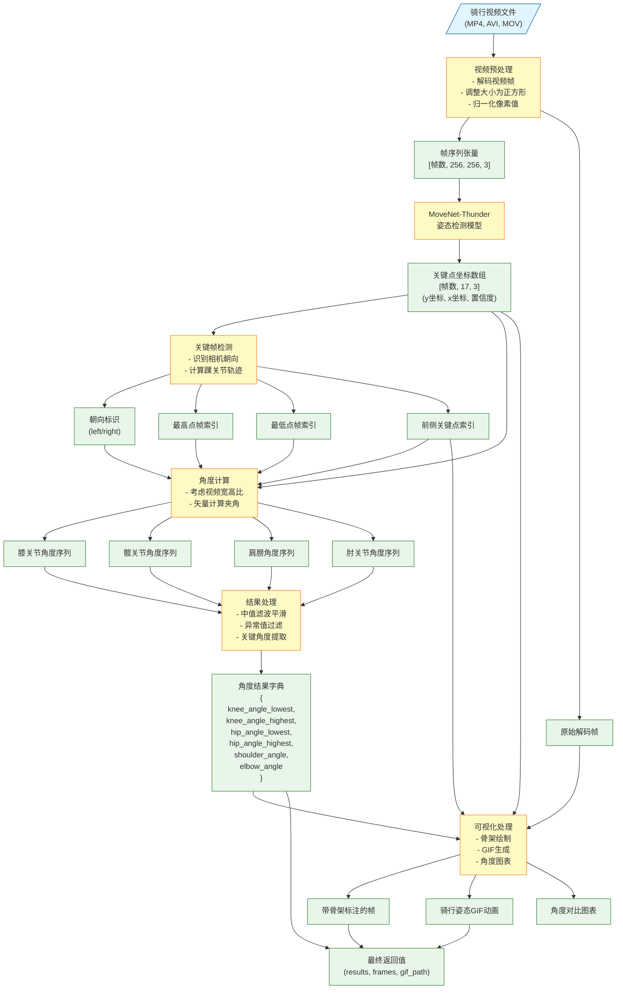
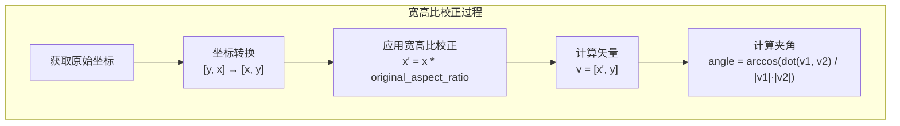

# 自行车骑行姿态检测包

## 简介

该姿态检测包是一个专为自行车骑行姿态评估设计的工具，基于人工智能视觉技术，能够从视频中自动识别骑行者的身体姿态，分析关键关节角度，帮助用户优化骑行姿势，提高效率并减少伤害风险。

<!-- 
图片引用说明：
1. 使用PoseAnalyzer处理示例视频后，将生成的GIF放在此处
2. 示例图片路径：../docs/images/pose_detection_example.gif
-->


> 注：运行示例代码后，将会在`docs/images`目录中生成可视化示例图片。请参考`docs/images/README.md`了解如何生成示例图片。

## 核心功能

- **智能关键点识别**：自动检测人体17个关键点位置
- **骑行姿态分析**：计算并评估关键关节角度
  - 膝关节角度（踏板最高点和最低点）
  - 髋关节角度（踏板最高点和最低点）
  - 肩膀角度
  - 肘关节角度
- **可视化结果**：生成带骨架标注的视频，直观展示骑行姿态

## 使用方法

### 快速上手

```python
from pose_detection import PoseAnalyzer

# 初始化分析器
analyzer = PoseAnalyzer()

# 分析骑行视频
results, frames, gif_path = analyzer.pose_analyzer("骑行视频.mp4")

# 查看分析结果
print(f"膝关节角度（最低点）: {results['knee_angle_lowest']}°")
print(f"膝关节角度（最高点）: {results['knee_angle_highest']}°")
print(f"髋关节角度（最低点）: {results['hip_angle_lowest']}°")
print(f"髋关节角度（最高点）: {results['hip_angle_highest']}°")
print(f"肩膀角度: {results['shoulder_angle']}°")
print(f"肘关节角度: {results['elbow_angle']}°")
```

### 关节角度说明

| 角度类型 | 说明 | 理想范围 |
|---------|------|---------|
| 膝关节最低点 | 踏板最低位置时大腿与小腿角度 | 150-155° |
| 膝关节最高点 | 踏板最高位置时大腿与小腿角度 | 65-70° |
| 髋关节角度 | 躯干与大腿的夹角 | 视骑行风格而定 |
| 肩膀角度 | 躯干与上臂的夹角 | 约90° |
| 肘关节角度 | 上臂与前臂的夹角 | 160-170° |

### 关键点索引说明

MoveNet模型检测的17个关键点及其在骑行姿态分析中的应用：



系统会根据相机拍摄角度自动判断使用左侧或右侧的关键点进行计算。例如，如果骑行者右侧面对相机，则使用右侧关键点（6, 8, 10, 12, 14, 16）进行分析；反之亦然。

## 技术特点

- **高精度姿态检测**：采用Google MoveNet-Thunder模型
- **智能关键帧识别**：自动定位踏板最高点和最低点
- **自适应视频处理**：支持不同尺寸和方向的视频输入
- **考虑宽高比的角度计算**：确保测量精度

## 算法流程

下面的流程图展示了骑行姿态分析的完整处理过程：



### 数据流程图（输入输出）

下面的流程图详细展示了每个处理阶段的输入和输出数据：



## 录制视频建议

为获得最佳检测效果，请遵循以下录制建议：

- **拍摄角度**：侧面视角，确保能清晰看到骑行者的侧面轮廓
- **光线条件**：充足自然光，避免逆光
- **服装选择**：穿着与背景对比明显的服装
- **视频质量**：分辨率不低于720p
- **骑行姿势**：保持自然骑行状态，完成至少3-5个完整踏蹬周期

## 角度测量示意图

以下图表展示了系统计算的关键角度测量方式：

```mermaid
graph TD
    subgraph 最低点膝关节角度
    direction LR
    A1[髋关节] --- B1[膝关节]
    B1 --- C1[踝关节]
    
    style B1 fill:#f66,stroke:#333,stroke-width:2px
    
    %% 添加角度弧线
    D1(("150-155°"))
    end
    
    subgraph 最高点膝关节角度
    direction LR
    A2[髋关节] --- B2[膝关节]
    B2 --- C2[踝关节]
    
    style B2 fill:#f66,stroke:#333,stroke-width:2px
    
    %% 添加角度弧线
    D2(("65-70°"))
    end
    
    subgraph 髋关节角度
    direction LR
    A3[肩关节] --- B3[髋关节]
    B3 --- C3[膝关节]
    
    style B3 fill:#f66,stroke:#333,stroke-width:2px
    end
    
    subgraph 肩膀角度
    direction LR
    A4[肘关节] --- B4[肩关节]
    B4 --- C4[髋关节]
    
    style B4 fill:#f66,stroke:#333,stroke-width:2px
    
    %% 添加角度弧线
    D4(("约90°"))
    end
    
    subgraph 肘关节角度
    direction LR
    A5[肩关节] --- B5[肘关节]
    B5 --- C5[手腕]
    
    style B5 fill:#f66,stroke:#333,stroke-width:2px
    
    %% 添加角度弧线
    D5(("160-170°"))
    end
```



### 宽高比校正说明

由于视频在预处理时会被调整为正方形（MoveNet要求），这会导致原始视频的宽高比发生变化，从而影响角度计算的准确性。为解决这个问题，系统会：

1. 在预处理阶段检测原始视频的宽高比（`original_aspect_ratio`）
2. 在角度计算时应用宽高比校正：



这种校正方法确保了即使原始视频是非正方形的（如横屏或竖屏视频），计算的关节角度也能准确反映真实的身体姿态。

## 常见问题

### Q: 为什么我的视频无法正确检测关键点？
A: 请检查视频拍摄角度是否为清晰的侧面视角，光线是否充足，以及骑行者是否清晰可见。

### Q: 测量的角度与专业自行车测量有差异，为什么？
A: 由于视频角度、衣物影响和AI模型的局限性，可能会有5-10°的误差，建议将结果作为参考，配合专业测量使用。

### Q: 如何判断我的骑行姿势是否合适？
A: 请参考理想角度范围，同时结合个人感受和专业建议。角度只是参考指标，最佳骑行姿势应适合个人身体条件和骑行风格。

### Q: 是否支持不同的骑行风格（如公路车、山地车）？
A: 是的，工具可用于各种骑行风格，但理想角度范围可能因骑行类型而异。

## 模块结构

```
pose_detection/
├── pose_analyzer.py     # 核心姿态分析类
├── model.py             # 模型加载和推理
├── preprocessing.py     # 视频预处理
├── postprocessing.py    # 数据后处理
├── cropping.py          # 图像裁剪功能
└── keypoints.py         # 关键点定义
```

## 安装依赖

```bash
# 使用conda创建环境
conda env create -f env-mac.yml
conda activate bike-fit

# 或使用pip安装核心依赖
pip install tensorflow tensorflow-hub numpy opencv-python matplotlib imageio scipy kagglehub
```

## 开发团队

该工具由自行车科学研究小组开发，致力于将人工智能技术应用于自行车运动科学研究。

## 许可证

MIT License 